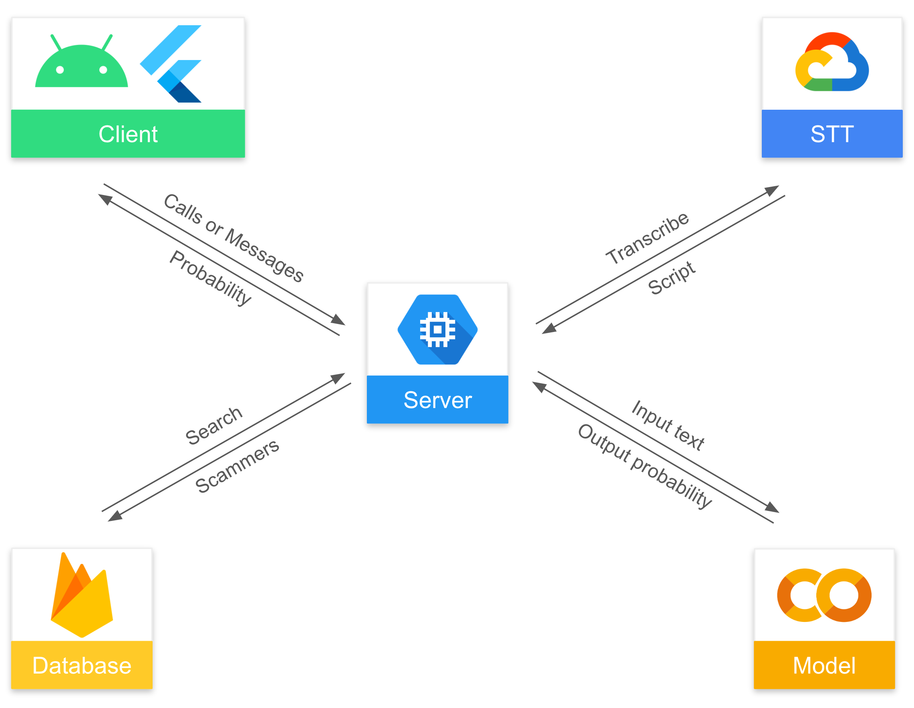

# The-Voice

 

**The conversation content-based AI scam call detection application for seniors who may not be familiar with modern technology or fraudulent schemes.**

## Environments

Android 9 or above

## Members

**_GDSC KAIST (Korea Advanced Institute of Science and Engineering)_**

Seungho Jang (hoosong0235@gmail.com) - Frontend

Kyungho Byoun(clearman001@gmail.com) - Team Lead, Backend

Taeil Kim(kti5589@gmail.com) - ML Model construction

Jongeun Park(abepje@gmail.com) - Data processing

## Implementation

| Component | Stacks | Responsibility |
| --- | --- | --- |
| [Client](https://github.com/KAIST-Google-Solution-Challenge/frontend) | Flutter | User Interface |
| [Server](https://github.com/KAIST-Google-Solution-Challenge/backend) | Node.js, Google Compute Engine, Google Speech-to-Text | Pipeline to connect with services |
| [Model](https://github.com/KAIST-Google-Solution-Challenge/conversation_model) | Google Colab | Classify text input to probability of being fraudulent |
| [Data Preprocessing](https://github.com/KAIST-Google-Solution-Challenge/data_preprocess) | Python, Google Speech-to-Text | Gather voice phishing dataset |
| [Database]() | Firebase | Store Phone Scam Data |

## Architecture

## Google Products and Platforms

## Reference

## Contacts

Kyungho Byoun : clearman001@gmail.com
