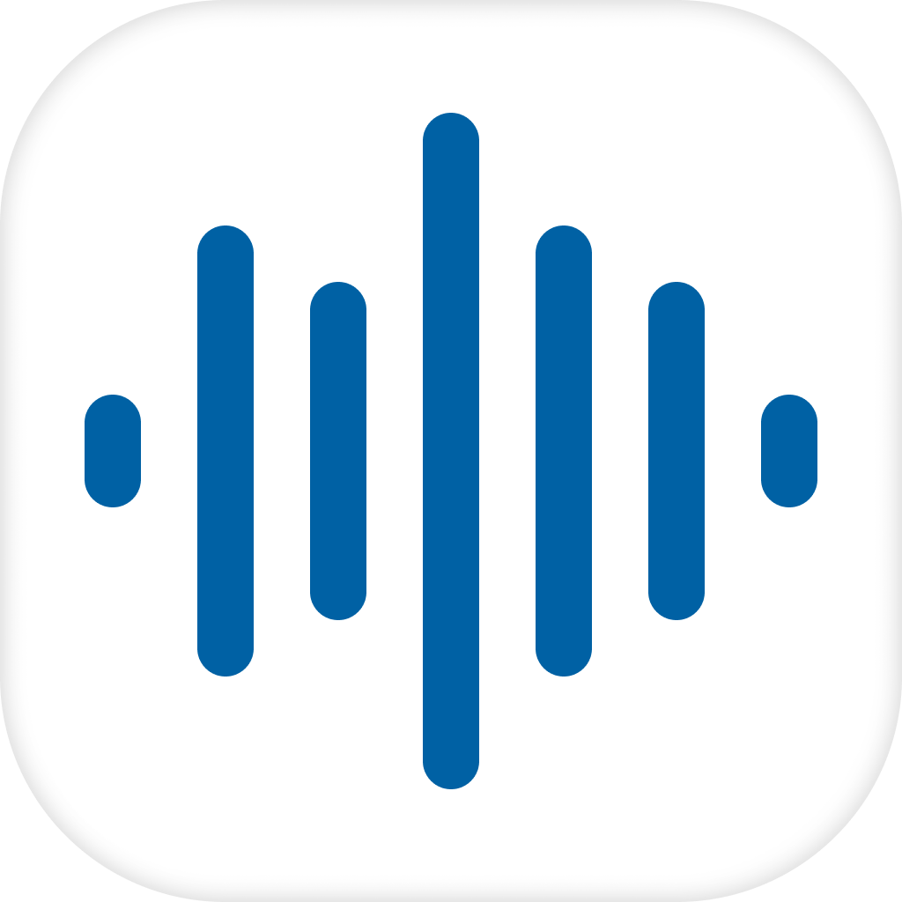
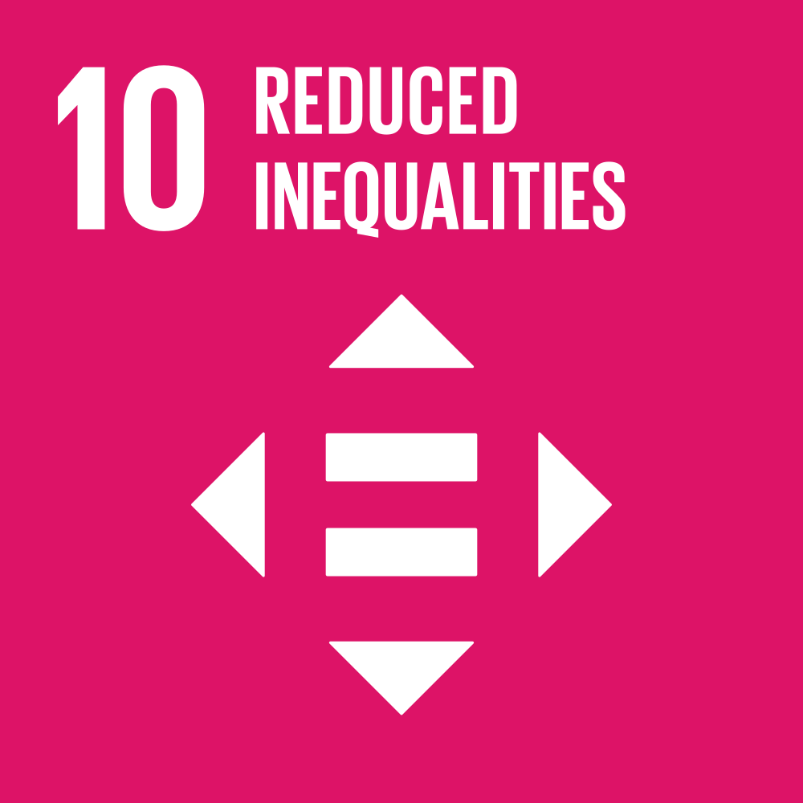

# The-Voice

**"The Voice", is an AI-based application that uses conversational content to detect scam calls. Our goal is to protect seniors by analyzing call recordings using a deep-learning based model.**

### 10. Reduced Inequalities

In Korea, there is a growing problem of phone scams that are specifically targeting elderly individuals who may not be knowledgeable about modern technology or fraudulent activities. The scams are becoming increasingly sophisticated, making it more challenging to identify them. Since seniors are less likely to recover financially and account for 56.8 percent of victims, these scams are more lethal than all other crimes to the elderly.

## Demo Video

## Environments

Android 9 or above

## Members

**_GDSC KAIST (Korea Advanced Institute of Science and Engineering)_**

Seungho Jang (hoosong0235@gmail.com) - Frontend

Kyungho Byoun(clearman001@gmail.com) - Team Lead, Backend

Taeil Kim(kti5589@gmail.com) - ML Model construction

Jongeun Park(abepje@gmail.com) - Data processing

## Implementation

| Component | Stacks | Responsibility |
| --- | --- | --- |
| [Client](https://github.com/KAIST-Google-Solution-Challenge/frontend) | Flutter | User Interface |
| [Server](https://github.com/KAIST-Google-Solution-Challenge/backend) | Node.js, Google Compute Engine, Google Speech-to-Text | Pipeline to connect with services |
| [Model](https://github.com/KAIST-Google-Solution-Challenge/conversation_model) | Google Colab | Classify text input to probability of being fraudulent |
| [Data Preprocessing](https://github.com/KAIST-Google-Solution-Challenge/data_preprocess) | Python, Google Speech-to-Text | Gather voice phishing dataset |
| [Database]() | Firebase | Store Phone Scam Data |

## Architecture

## Google Products and Platforms

  
   
  
  
  

## Reference

## Contacts

Kyungho Byoun : clearman001@gmail.com
